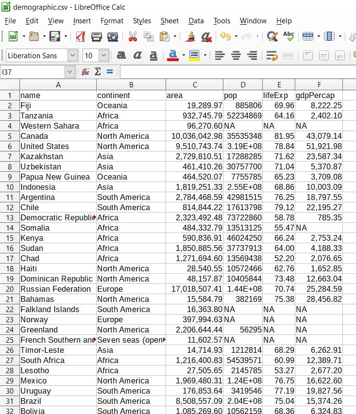

# Importing data with **readr** {#readr}
You can  lean R with the dataset it comes with when you install it in your machine. But sometimes you want to use the real data you or someone gathered already. One of critical steps for data processing is to import data with special format into R workspace.Data import refers to read data from the working directory into the workspace [@mathew]. In this chapter you will learn how to import common files into R. We will only focus on two common types of tabular data storage format---The comma-seprated `.csv` and excell spreadsheet (`.xlsx`). In later chapter we will explain how to read other types of data into R. 


## *Comma-Separated (.csv)*

The most commonly format that R like is the `comma-separated` files. Although Base R provides various functions like `read.table()`, `read.csv()`, `read.table()` and `read.csv2()` to import data from the local directories into R workspace, for this book we  use an `read_csv()` function from `readr`. Before we import the data, we need to load the packages that we will use their functions in this chapeter
 
```{r packages-import, warning=FALSE, message=FALSE, comment=""}
require(dplyr)
require(readr)
require(lubridate)
require(readxl)
require(haven)
require(ggplot2)
require(kableExtra)

```

Consider a tabular data stored in my working directory in the `.csv` format in figure \@ref(fig:fig31). 
```{r fig31, fig.align="center", out.width="100%", fig.cap="A screenshot of the sample dataset", echo=FALSE}


```


We can import it with the `read_csv()` functions as:
```{r, message=TRUE, warning=TRUE, comment=""}
demographic = read_csv("demographic.csv") 

```

When `read_csv()` has imported the data into R workspace, it prints out the name and type of of data for each variable.

By simply glimpse the dataset, we see the format of the data is as expected. It has six variables(columns) and 177 observations (rows) similar to figure \@ref(fig:fig31). Table \@ref(tab:tab31) show sample of imported dataset. It contains six variables are `name of the country`, `continent`, `areas of the country in square kilometer`, `population of the country`, `life expectancy` and the `GDP of the country in percent`. The NA values indicates missing data in the data set. 

```{r tab31, echo=FALSE}
demographic %>% sample_n(12)%>%
  kable(format = "html", digits = 2, caption = "World demographic information", col.names = c("Country", "Continent", "Area (Km^2)", "Population", "Life Epectancy (Years)", "GDP")) %>%
  column_spec(column = 1:6, width = "4cm", color = "black" )
```


## Microsoft Excel(.xlsx)
Commonly our data is stored as a MS Excel file. we can import the file with  `read_xlsx()` function of `readxl` package. The `readxl` package provides a function read_exel() that allows us to specify which sheet within the Excel file to read and what character specifies missing data (it assumes a blank cell is missing data if you don't specifying anything). The  function automatically convert the worksheet into a `.csv` file and read it.


```{r}
audit = readxl::read_xlsx("audit.xlsx")
```

The `audit` file is from the `rattle` package developed by @rattle. The dataset which is artificially constructed that has some of the charactersitcis of a true financial audit. I just saved it into the working directory as Excel spreadsheet. We will use this file to illustrate how to import the excel file into R workspace with `readxl` package [@readxl]. We look on the internal structure of the `audit` file with the `glimpse()` function. You can interact with the table that show all variables and observations (Table \@ref(tab:tab31))
```{r}
audit%>%glimpse()
```


```{r tab13 }
DT::datatable(audit, rownames = FALSE, caption = "An Interactive table showing the audit data")
```


Look the frequency
```{r}
audit$Employment%>%table()
```

```{r}
audit$Gender%>%table()%>%barplot(horiz = TRUE)

as.POSIXct("1920-10-12 10:05:3") %>% class()

```

```{r}
audit$Marital%>%table()%>%barplot(horiz = TRUE)

```

## Writing t a File
Sometimes you work in the document and you want to export to a file. **readr** has 
`write_csv()` and `write_tsv()` functions that allows to export data frames from workspace to working directory

```{r eval=FALSE}
write_csv(audit, "audit.csv")
write_

```

@r4d recomment the use of `write_excel_csv()` function when you want to export a data frame to Excel. **readr** has other tools that export files to other software like SAS, SPSS and more ...
```{r}
write_excel_csv(audit, "audit.xls")
```


## Basic Data Manipulation
In this section, we brifely introduce some basic data handling and manipulation techniques, which are mostly associated with data frame. A data frame is a a tabular shaped contains columns and rows of equal length. In general a data frame structure with rows representing observations or measurements and with columns containing variables. 

### Explore the Data Frame
We can visualize the table by simply run the name of the data `flights`
```{r}
flights = read_csv("flights.csv")

flights
```

we can use `class()` to check if the data is data frame
```{r}
flights %>% class()
```

We can use `names()` to extract the variable names
```{r}
flights %>% names()
```

We can explore the internal structure of `flights` object with a `dplyr()`'s function `glimpse()`
```{r}
flights %>% glimpse()
```

We can check how rows (observations/measurements) and columns (variables/fields) are in the data
```{r}
flights %>% dim()
```

The number of rows (observation) can be obtained using `nrow()` function
```{r}
flights %>% nrow()
```

The number of columns (variables) can be obtained using `ncol()` function
```{r}
flights %>% ncol()
```

The length of the data frame is given by
```{r}

flights %>% length()

```

### simmple summary statistics
The most helpful function for for summarizing rows and columns is `summary()`, which gives a collection of basim cummary statistics. The first method is to calculate some basic summary statistics (minimum, 25th, 50th, 75th percentiles, maximum and mean) of each column. If a column is categorical, the summary function will return the number of observations in each category.


```{r}
flights %>% summary()
```

You noticed that the `summary()` function provide the common metric for `central tendency` and ` measure of dispersion`. We will look at them later.  Now we turn to our favourite package `dplyr`

```{r}
```
