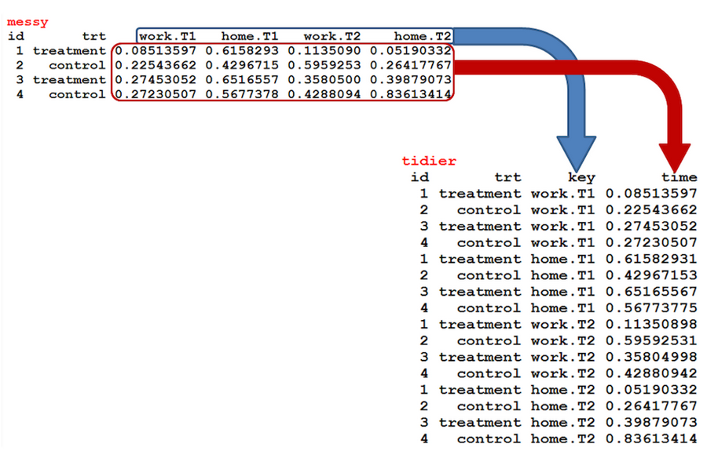

# Reshaping data with tidyr
Most of the time, our data is in the form of a data frame and we are interested in exploring the relationships. However most procedures in R expect the data to show up in a 'long' format where each row is an observation and each column is a variable. In practice, the data is often not stored like that and the data comes to us with repeated observations included on a single row. This is often done as a memory saving technique or because there is some structure in the data that makes the 'wide' format attractive. As a result, we need a way to convert data from 'wide' to 'long' and vice-versa.

`tidyr` is a one such package which was built for the sole purpose of simplifying the process of creating tidy data [@tidyr]. This tutorial provides you with the basic understanding of the four fundamental functions of data tidying that tidyr provides:

+ `gather()` makes "wide" data longer
+ `spread()` makes "long" data wider
+ `separate()` splits a single column into multiple columns
+ `unite()` combines multiple columns into a single column

 
```{r packages-tidyr, warning=FALSE, message=FALSE, comment=""}
require(dplyr)
require(readr)
require(lubridate)
require(readxl)
require(haven)
require(ggplot2)
require(kableExtra)
require(tidyr)
```


## `gather( )` function:
There are times when our data is considered unstacked and a common attribute of concern is spread out across columns. To reformat the data such that these common attributes are gathered together as a single variable, the gather() function will take multiple columns and collapse them into key-value pairs, duplicating all other columns as needed. in short `gather()` function  reshape wide format to long format (Figure \@ref(fig:fig11))

```{r fig11, fig.cap="Reshaped data set from wide to long format", out.width = "100%", echo=FALSE}

```
The data in table \@ref(tab:tab14) data is considered wide since the time variable (represented as quarters) is structured such that each quarter represents a variable. To re-structure the time component as an individual variable, we can gather each quarter within one column variable and also gather the values associated with each quarter in a second column variable.
```{r tab14}
wide = read_table2("wide_data.txt")
wide %>%
  kable("html", caption = "Revenue data in Wide form")%>%
  column_spec(column = 1:6, width = "3cm", color = 1) %>%
  add_header_above(c("" , "", "Income per Quarter" = 4), line = T)
```
We use the `gather()` function to convert data in table \@ref(tab:tab14) to long form widely known as indexed data shown in table \@ref(tab:tab15)
```{r}
long = wide %>% 
  gather(key = "key", value = "Revenue", 3:6)
```

```{r tab15, echo=FALSE}
long %>%
  kable("html", caption = "Revenue data in long form", align = "c")%>%
  column_spec(column = 1:4, width = "3cm", color = 1)
```

The `spread() function is a complement function `gather()` as it convert long format dataset into wide form
```{r eval=FALSE}
wide.wide = long %>% spread(key = "key", value = "Revenue")
```

## `separate( )` function:
Many times a single column variable will capture multiple variables, or even parts of a variable you just don't care about. Examples include is data in table \@ref(tab:tab16)). 

```{r}
usa = read_csv("separate.csv")
```

```{r tab16, echo=FALSE}
usa %>%
  kable("html", caption = "Messy data with variable combined", align = "c")%>%
  column_spec(column = 1:5, width = "5cm", color = 1)
```
In each of these cases, our objective may be to separate characters within the variable string. This can be accomplished using the `separate()` function which splits a single variable into multiple variables. Table \@ref(tab:tab17) show the tidy data after the variables were separated. The complement function to `separate()` is the `unite()`, which merge two variables into one.
```{r}
usa.sep = usa %>% 
  separate(Grp_Ind, c("Group", "Individual"),  remove = TRUE, convert = TRUE) %>% 
  separate(Yr_Mo, c("Year", "Month"),  remove = TRUE, convert = TRUE) %>% 
  separate(City_State, c("City", "State"),  remove = TRUE, convert = TRUE) %>% 
  separate(First_Last, c("First", "Last"),  remove = TRUE, convert = TRUE) %>% 
  separate(Extra_variable, c("Extra", "Variable"),  remove = TRUE, convert = TRUE)


```


```{r tab17, echo=FALSE}
usa.sep %>%
  kable("html", caption = "Tidy data with variable separated", align = "c")%>%
  column_spec(column = 1:10, width = "5cm", color = 1)
```
