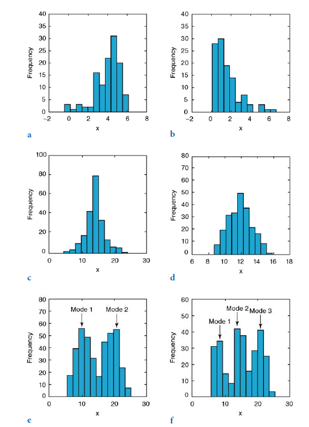

# Univariate Statistics

## Introduction
Statistical properties of a single parameter are invegated by means of univariate analysis. Such a parameter could, for example be the the size of population, the the gross domestic product (GDP) of the country in the world or life expactancy of the country. Because in most cases the data we collect depend on the sample size that are often limited because of either financial or logistic constraints. The method of univariate statistics assist us to draw from the sample conclusions that apply to the population as whole [@trauth]. **R** contains myriad of tools for statistical analysis. We will use the base package **stats** with other extended packages to illustrate concept of univariate statistics [@r]. 

## Empical Distributions
Let us assume that we have collected a number of measurement of $x_i$ from a specific area. The collection of data, or sample, as a subset of the population of interest can be writeen as a vector of $x$ containing a total of $N$ observations mathematically in equation \@ref(eq:eq81). The vector $x$ may contain a large number of data points and it may conseuently be difficult to understand its properties. Descriptive statists are therefore often used to summarize the characteristics of the data. THe statistical properties of the data set may be used to define an empirical distribution, which can then be compared to a theoretical one. 

$$
\begin{equation}
x = (x_1, x_2, \dots, x_n) (\#eq:eq81)
\end{equation}
$$

The most straightfoward way of investigating the sample characteristics is to plot the data graphically. Plotting all the data points along a single axis does nto reveal a great deal of information about the dat set. However, the density of the points along the scale does provide some information about the characteristics of the data. A widely used graphical display of continous univariate variable is the *histogram*^[A histogram is a barplot of a frequency distribution that is organized in intervals or classes]. Histogram provide vital information on the characteristics of the data like the *central tendency*, the *dispersion* and general *shape* of the distribution of quantitative data (Figure \@ref(fig:fig81). In general term, the central tendency parameters---the *mean* and *median* define the center of the dataset, while the *range* and *standard deviation* provide information of how the data deviate from the center. 

```{r, echo=FALSE}
require(tidyverse)

```


```{r fig81, fig.align="center", fig.height=3.5, fig.width=3.5, fig.cap="Emprical distribution of the frequency of quantitatively data", echo=FALSE}

sst = rnorm(1500, 25,.25)
chl = rnorm(1500,.025,0.03)
sites = rep(c("Mafia", "Zanzibar", "Pemba"), each = 500)
season = rep(c("NE","SE"), each = 250, times = 3)

oceano = data.frame(sites, season, sst, chl)

ggplot(data = oceano, aes(x = sst)) + geom_histogram(bins = 15, col = "white")+
  theme(panel.background = element_rect(colour = "black"))+
  labs(x = NULL, y = "Frequency")+
  scale_x_continuous(breaks = seq(23.8,25.8, .5))
```

### Measure of Central Tendency

The *median* and *mean* are parameters of central tendency or location represent the most important measure for describing emperical distribution of quantitative data. These parameters help locate the data on a linear scale. They represent a typical or best value that describe the data. The most most popular indicator of central tendency is the *arithmetic mean*, which is the sum of all data points divided by the total number of observations. The *arithmetic mean can be computed with equation \@ref(eq:eq82)

$$
\begin{equation}
\bar x = \frac{1}{N}\sum_{i=1}^N x_i (\#eq:eq82)
\end{equation}
$$

The *arithmetic mean* is also called *mean* or the *average* of a unvariate variable. The sample mean is used as an estimate of the population mean $\mu$  for the underlying theoretical distribution. The arithmetric mean is, however, sensitive to outlier---extreme values that may be very dfferent from the majoriy of the data, hence *median* is often used an an alternative measured of central tendency. The *median* is the $x$-value that is in the middle of the variable, i.e 50% of the observations are smaller than the median and 50% are larger [@trauth]. The median of a quantitative data sorted in ascending order is mathematically written as equation \@ref(eq:eq83) if $N$ is odd; and equation \@ref(eq:eq84) if $N$ is even. 

$$
\begin{equation}
X = x_{(N+1)/2} (\#eq:eq83)
\end{equation}
$$


$$
\begin{equation}
X =x_{N/2} + x_{(N+1)/2} (\#eq:eq84)
\end{equation}
$$

The third important measure for central tendeny is the mode. The mode is the most frequent $x$-value. Or for the grouped data, the the ccenter is the class with the largest number of observations. If the data values in the variable are unique that datase will have no mode. Frequency distribution with a single mode are called *unimodla*, but there variables with two modes(*bimodal*), three modes(*trimodal*) or four or more modes (*multimodal*) (Figure \@ref(fig:fig82))


```{r fig82, fig.align="center", fig.height=4.5, fig.width=7.5, fig.cap="Dispersion and shape of distribution, a-b) unimodal distribution showing a negative or positive skew, c-d) distribution showing a high or low kurtosis, e-f) bimodal and trimodal distribution showing two or more modes. Source [@trauth]", echo=FALSE}

 

```

The mean, median, and mode are used when several quantities add together to produce a total, wherea the *geometric mean* is often used if these quantities are multiplied. Let us assume that the economy of country $x$ increases by 10% the first year, 25% in the second year , and 60% in the last year. The average rate of increase is not the arithmetic mean, because the original number of individual has increase by a factor (not sum) of `r 110/100` after one year, `r 125/100` after the second year and `r160/100` after the third year. The average growth of the economy is therefore calculated by the geometric mean with equation \@ref(eq:eq85)


$$
\begin{equation}
\bar x_g = (x_1 \times x_2 \times \dots x_n)^\frac{1}{N} (\#eq:eq85)
\end{equation}
$$

The average growth of these values is 1.3006 suggesting an approximate per annum growth in the economy of 30%. The arithmetic mean would result in an errenous value of 1.3167 of approximately 32% annual growth. The geometric mean is also a sueful mesure of central tendency for skewed or log-normal distributed data, in which the logarithms of the observation follow a Gausian or normal distribution. The geomeric mean, however, s not used for variables containing negative values. 

The last is the *harmonic mean* used to derive a mean value for asymetric or log-normal distributed data similar to geometric mean. Unfortunate, the harmonic mean is sensitive to outlier. The harmonic mean is a better average when values are defined in relation to a particular unt. A commonly quoted example is averging velocity. The harmonic mean is also used to compute the mean of the sample sizes. The equation \@ref(eq:eq86) is used to compute harmonic mean.


$$
\begin{equation}
\bar x_H =\frac{N}{(\frac{1}{x_1} + \frac{1}{x_2} + \dots +\frac{1}{x_N})} (\#eq:eq86)
\end{equation}
$$

### Measure of Dispersion
A second important component of the distribution is the *dispersion*. Some of the parameters that can be used to quantify dispersion are illustrated in figure \@ref(fig:fig82). The simplest way to describe the dispersion of a dat ase is by the *range*--- a difference between the highest and the lowest value in the quantitative data. The range can be computed with equation \@ref(eq:eq87)

$$
\begin{equation}
\delta x = X_{max} - X_{min} (\#eq:eq87)
\end{equation}
$$

Since the range is defined by the two extreme data points it is very susceptible to outliers and hence it is not a reliable measure of dispersion in most cases. Using the interquantile range of data---the middle 50% of the data attempt to overcome this problem. The widely used measure for dispersion is the standard deviation---the average deviation of each data point from the mean. The standard deviation of sample in an emprical distribution is often used as an estimate of the population standard deviation $\sigma$ equation \@ref(eq:eq88)


$$
\begin{equation}
s = \sqrt {\frac{\sum \limits_{i=1}^N (x_i - \bar x)}{N-1}} (\#eq:eq88)
\end{equation} 
$$
 The s formula for the poulation standard deviation uses $N$ instead of $N-1$ as the denominator. The sample standard deviation $s$ is computed with $N-1$ instead of $N$ since it uses the sample mean instead of the unknown population mean. The sample mean, however, is computed from the data $x_p$ which reduce the number of degrees of freedom by one. The *degree of freedom* are number of values in a distribution that are free to be varied. Dividing the average deviation of the data from the mean by $N$ would therefore underestimate the population standard deviation $\sigma$.
 
The *variance* is the third important measure of dispersion. The variance is the square of the standard deviation equation \@ref(eq:eq89).

$$
\begin{equation}
s^{2} = \frac{\sum\limits_{i=1}^{n} \left(x_{i} - \bar{x}\right)^{2}} {n-1} (\#eq:eq89)
\end{equation} 
$$
 
Although the variance has the disadvantage of mismatch dimension with original data, it is extensively used in many applications than the standard deviation.

Other measure of distribution are *skewness* and *kurtosis* that are used to describe the shape of a frequency distribution (Fig).  Skewness is a measure of the asymmetry of the tails of a distribution. A negative skew indicates the distribution is spread out more to the left of the mean value, assuming values increasing towards the right along the axis. Distribution with positive skewness have large tails that extend toward the right. Although Pearson' formular for measure skewness is useful, the Fisher formular in equation \@ref(eq:eq810) is used instead

```{r  fig83, fig.align="center", fig.height=2.5, fig.width=7.5, fig.cap="Distribution showing the shape of distribution with a) normal distribution and b)left skewness, and c)normal, echo=FALSE}

find.yz = function(x, xbar, s2){
  N    = length(x) + 2
  sumx = sum(x)
  sx2  = as.numeric(x%*%x)          # this is the sum of x^2
  a    = -2
  b    = 2*(N*xbar - sumx)
  c    = -N*xbar^2*(N-1) - sx2 - sumx^2 + 2*N*xbar*sumx + (N-1)*s2
  rt   = sqrt(b^2 - 4*a*c)

  z    = (-b + rt)/(2*a)
  y    = N*xbar - (sumx + z)
  newx = c(x, y, z)
  return(newx)
}

set.seed(62)
x    = rnorm(2)
newx = find.yz(x, xbar=0, s2=1)
newx                                # [1] 0.8012701  0.2844567  0.3757358 -1.4614627
mean(newx)                          # [1] 0
var(newx)  


set.seed(82)
xDf = matrix(NA, ncol=4, nrow=10000)
i   = 1
while(i<10001){
  x       = rnorm(2)
  xDf[i,] = try(find.yz(x, xbar=0, s2=2), silent=TRUE)  # keeps the code from crashing
  if(!is.nan(xDf[i,4])){ i = i+1 }                      # increments if worked
}

xdf.tb = xDf %>% as.data.frame() %>% gather(key = "key", value = "value")
  
  normal = ggplot(data = xdf.tb %>% filter(key == "V1"), aes(x = value)) + 
    geom_histogram(col = "white", bins = 12)+
  theme(panel.background = element_rect(colour = "black"))+
  labs(x = NULL, y = "Frequency")
  
  
  left.skew = ggplot(data = xdf.tb %>% filter(key == "V3"), aes(x = value)) + 
    geom_histogram(col = "white", bins = 12)+
  theme(panel.background = element_rect(colour = "black"))+
  labs(x = NULL, y = "Frequency")
  
  right.skew = ggplot(data = xdf.tb %>% filter(key == "V4"), aes(x = value)) + 
    geom_histogram(col = "white", bins = 12)+
  theme(panel.background = element_rect(colour = "black"))+
  labs(x = NULL, y = "Frequency")
  
  cowplot::plot_grid(normal,left.skew, right.skew, nrow = 1, labels = c("a)", "b)", "c"), label_x = .30, label_y = .98, label_fontface = "plain", label_size = 12)
  
# +
#   scale_x_continuous(breaks = seq(23.8,25.8, .5))
```


$$
\begin{equation}
skewness = \sum\limits_{i=1}^{n} {\frac{(x_i - \bar x)^3}{s^3}}(\#eq:eq810)
\end{equation} 
$$
 
 The second important measure of the shape of a distribution is the *kurtosis* that can be computed with a formulae in equation \@ref(eq:eq811). Kurtosis measure whether the data are peaked or flat relative to a normal distribution. A high kurtosis indicates that the distribution has a distinct peak near the mean, whereas a low kurtosis shows a flat top near the mean and broad tails. Higher peakedness in a distribution results from rare extreme deviations, whereas low kurtosis is caused by frequent moderate deviations. A normal distribution has a kurtosis of three, and some definitions therefore substract three from the above term in order to set the kurtois of the normal distribution to zero.
 

$$
\begin{equation}
kurtosis = \sum\limits_{i=1}^{n} {\frac{(x_i - \bar x)^4}{s^4}}(\#eq:eq811)
\end{equation} 
$$
. 